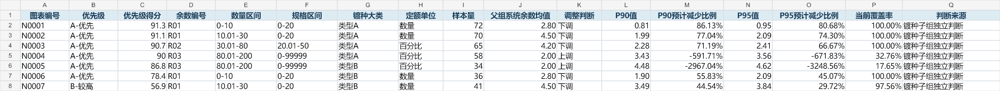

# Production Remainder Allocation Diagnostics

面向生产订单的余数放量规则诊断项目。项目通过历史订单实际损耗分布评估系统余数规则，在控制覆盖率风险的同时识别过量放量、覆盖不足和小样本规则，并输出Excel规则清单与可交互的实际损耗分布页面。

> 本仓库为可公开的项目展示版本。数据均为合成样例，不包含真实订单、CNT、物料、客户、补单或生产数据。

## 项目成果

- 建立从数据质量检查、预处理、补单版本链关联、规则诊断到业务报表的完整工作流。
- 第一阶段累计分析三个车间约28.3万条原始记录，形成数值调整、规则细分候选、无需调整和样本不足的分层诊断框架。
- 将表面处理规则从三维扩展为“余数编号×数量区间×规格区间×镀种大类”。
- 识别Tableau最小领进数量异常归零问题，并将正式实际损耗口径修正为“领进数量－报工数量”。
- 滚镀最新批次分析10.19万条原始记录、8.36万条有效样本和1,451个四维子规则。
- P95方案在总体覆盖率由95.04%调整至94.41%的情况下，预计减少16.16%的正向多余余数。
- 输出带优先级的Excel决策清单，以及支持搜索、导航、悬停和P99尾部说明的离线HTML报告。

详细项目经历见[docs/PROJECT_EXPERIENCE.md](docs/PROJECT_EXPERIENCE.md)。

## 核心口径

```text
实际损耗 = 领进数量 - 报工数量
覆盖率 = 余数 >= 实际损耗的订单占比
正向多余余数 = Σ max(余数 - 实际损耗, 0)
实际损耗率 = 实际损耗 ÷ 计划数量(不含余数) × 100%
```

规则层级：

```text
三维父规则 = 余数编号 × 数量区间 × 规格区间
四维子规则 = 三维父规则 × 镀种大类
```

子组样本量达到30时使用子组P90/P95；样本量不足时使用对应三维父组P90/P95，并在子组订单上重新评估覆盖率和正向多余余数。

方向判断不再设置覆盖率门槛，而是将P90-P95作为参考带：

```text
父组系统余数均值 > P95：建议下调
父组系统余数均值 < P90：建议上调
位于P90-P95之间或子组样本不足：维持现状
```

## 工作流


## 快速运行

要求：

- Python 3.10+
- pandas
- numpy
- openpyxl

```powershell
python -m venv .venv
.\.venv\Scripts\Activate.ps1
pip install -r requirements.txt
.\run_demo.ps1
```

也可以逐步执行：

```powershell
python src/generate_sample_data.py
python src/diagnose.py --input data/sample_preprocessed.csv --output-dir outputs
python src/build_reports.py --input outputs/diagnostics.json --output-dir outputs
```

运行后生成：

```text
outputs/diagnostics.json
outputs/rule_diagnostics.csv
outputs/rule_diagnostics.xlsx
outputs/loss_distribution.html
```

HTML文件可以直接离线打开。

仓库中的`examples/`保留了一套由合成数据生成的示例结果，可用于快速查看最终交付形式。



## 目录结构

```text
.
├─ data/
│  ├─ README.md
│  └─ sample_preprocessed.csv
├─ docs/
│  ├─ DATA_DICTIONARY.md
│  ├─ METHODOLOGY.md
│  └─ PROJECT_EXPERIENCE.md
├─ examples/
│  ├─ sample_loss_distribution.html
│  ├─ sample_rule_diagnostics.csv
│  ├─ sample_rule_diagnostics_preview.png
│  └─ sample_rule_diagnostics.xlsx
├─ outputs/
│  └─ .gitkeep
├─ src/
│  ├─ build_reports.py
│  ├─ diagnose.py
│  └─ generate_sample_data.py
├─ .gitignore
├─ requirements.txt
├─ run_demo.ps1
└─ SECURITY.md
```

## 诊断逻辑

### 数量与百分比定额

- 数量定额组：按实际损耗数量计算P90/P95。
- 百分比定额组：先计算逐单实际损耗率，再计算P90/P95，并按计划数量换算成订单余数。

### 总体减少比例

总体基准使用每张订单实际的系统余数字段，而不是图表中的父组系统余数均值：

```text
P95减少比例
= (Σ当前正向多余余数 - ΣP95方案正向多余余数)
  ÷ Σ当前正向多余余数
```

### 图表

- 横轴：实际损耗数量或实际损耗率。
- 纵轴：样本量。
- 三条线：父组系统余数均值、P90、P95。
- 样本不足子组明确显示父组P90/P95。
- 横轴绘制至P99，尾部样本只从图形中排除，不影响统计计算。

完整口径见[docs/METHODOLOGY.md](docs/METHODOLOGY.md)。

## 数据安全

不要把真实订单级数据直接提交到公开GitHub。真实项目中的原始主表、CNT映射、补单明细、数据库SQL和业务结果均未包含在本仓库中。

发布前请阅读[SECURITY.md](SECURITY.md)，并再次检查暂存区：

```powershell
git status --short
git diff --cached
```

## 项目边界

- 本仓库展示的是规则诊断和决策支持方法，不替代业务审批。
- P90/P95是风险与节余的参考档位，不代表自动上线值。
- 小样本回退只能降低估计波动，不能替代持续的数据积累。
- 数据源发生结构性变化时，应先完成数据库或业务系统核验，再解释规则效果。
